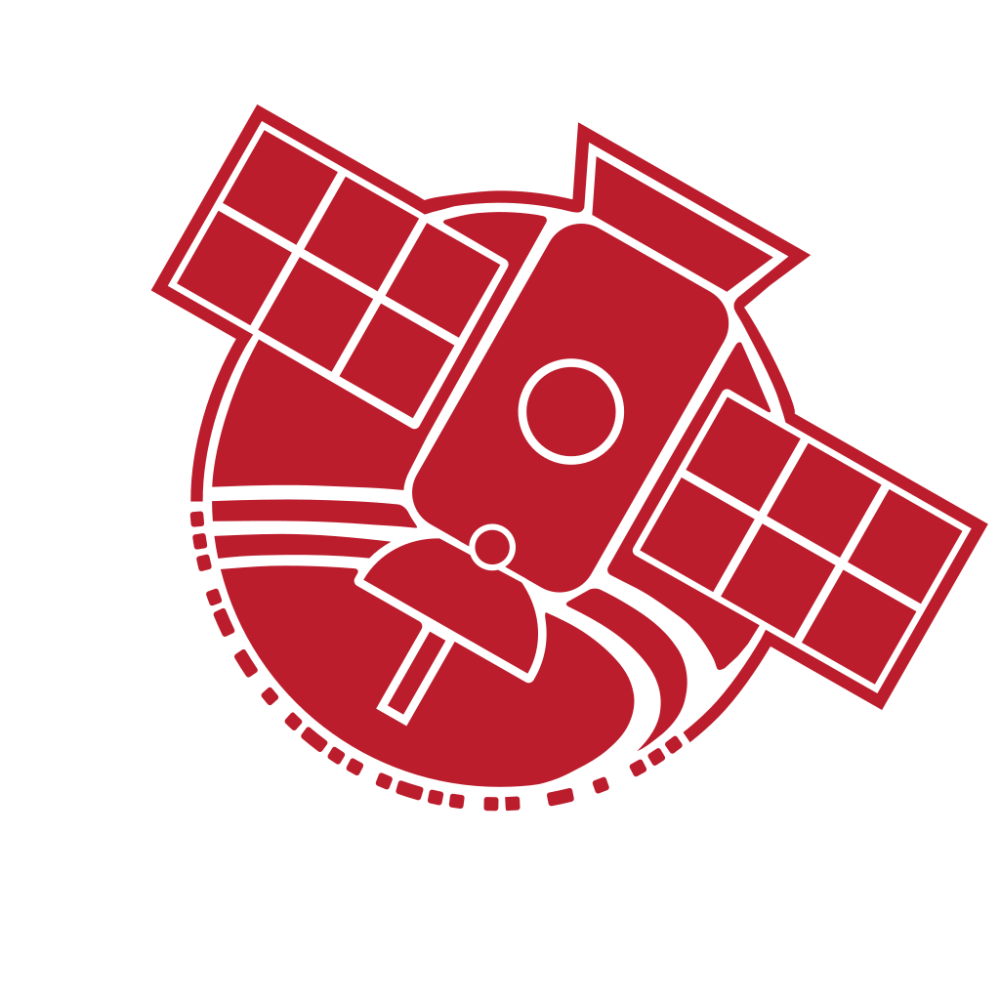

# Janus-Avionics

Welcome to SSI **Satellite Avionics**! Here, you can find everything you need to navigate our team! This repository covers weekly meeting times, technical trainings, team design documentation, assembly processes, testing procedures, and so much more!

If you have any questions, feel free to contact any AV Co-lead on Slack! Or feel free to email the Kale, the current AV co-lead repo manager at **kalesrz@stanford.edu**.

## Weekly Meeting Times
Satellite Avionics has two official meetings each week:

**Weekly Avionics Meeting**
 * **Time:** Thursday, 7:00 PM - 9:00 PM PST\
 * **Location:** Check The [#Satellite-Avionics](https://ssi-teams.slack.com/archives/C2L29KW8J) channel in the slack for weekly meeting locations!
 * **Purpose:** Avionics meetings are specifically for AV-specific work, training, and discussions. AV member attendance is expected outside of conflicting Midterms or Finals. Fall quarter attendance is **mandatory** outside of class conflicts or personal health reasons.

**Satsurday Meetings**
 * **Time:** Saturday, 12:00 PM - 3:00 PM PST
 * **Location:** Check The [#Satellite-Avionics](https://ssi-teams.slack.com/archives/C2L29KW8J) channel in the slack for weekly meeting locations!
 * **Purpose**: Satsurday meetings are Satellite Avionics Full-Team work days! Every subteam will be meeting at this time. This can sometimes happen collectively and sometimes separately. Fall quarter will mostly be dedicated to AV specific onboarding training and early satellite development. Fall quarter attendance is **mandatory** outside of class conflicts or personal health reasons.

## Getting Connected