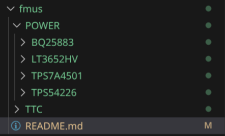
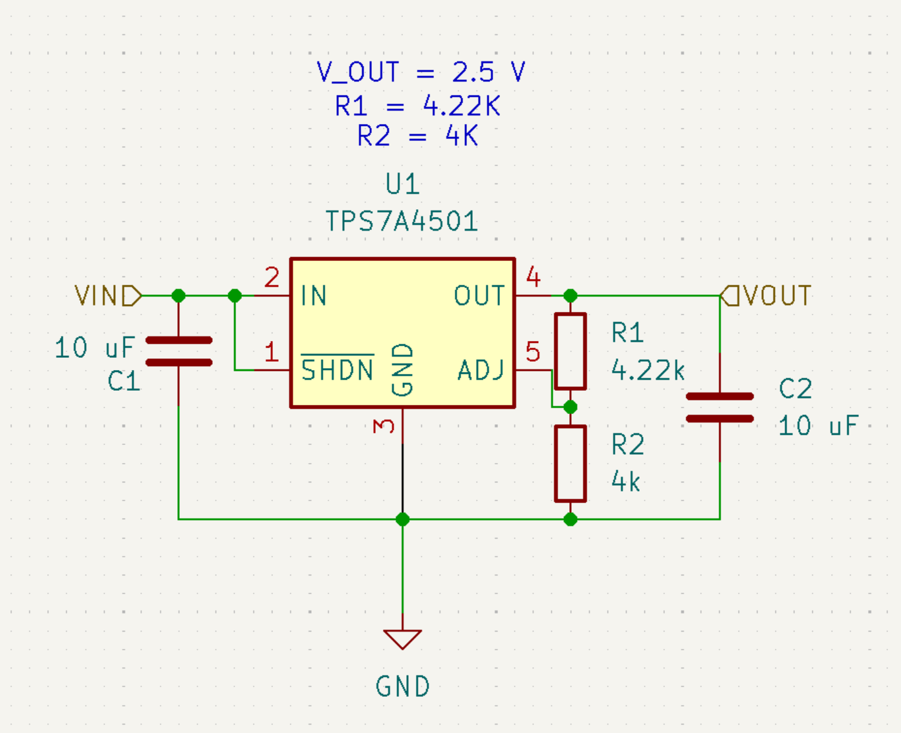
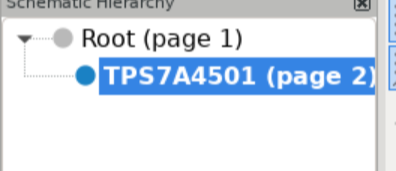
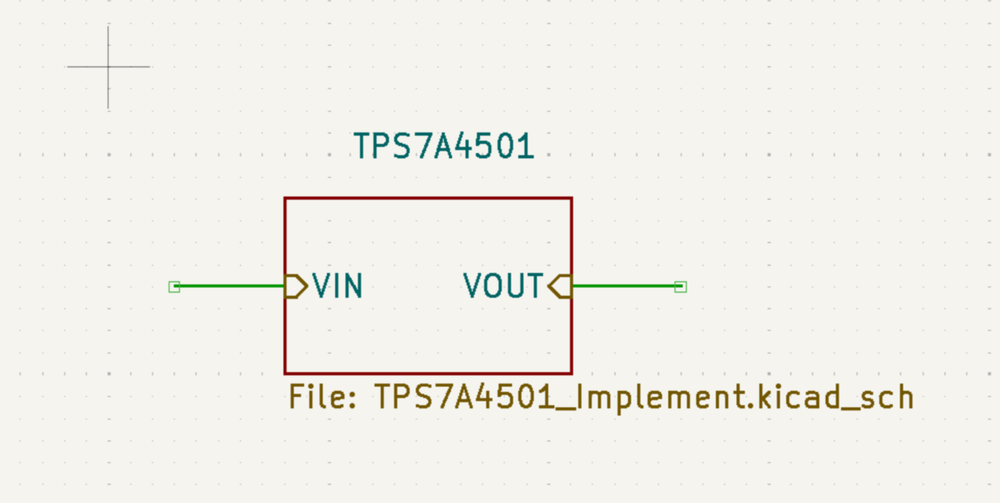

# Functional Modular Units

## A quick note on FMUs
A Functional Modular Unit (FMU) is SATS AV’s internal name for the following concept: An Integrated Circuit, Filter, Converter, or any other group of external components that fulfill a single task or purpose that can be accessibly integrated into any system that follows a set communication standard. FMUs must be easily integrable into boards that meet certain system-level defined power and communication standards and that require the functionality the particular FMU provides.

In essense, FMUs are the building blocks for our satellites, and using them simplifies our development process by 10 fold as any new designed will not have to worry about integrating a chip everytime they want to use it in a new design; they can simply skim a description of the FMU, run some calculations to shift values, and move on with their day.


### FMU structure

```bash
[Subsystem]
|   [FMU]
|    | - **FMU Name - Datasheet.pdf**
|    | - **FMU Name - Module/**
|    |   | - KiCad Project Files
|    | - **FMU Name - Notes.md** # Notes special considerations that should be looked at when designing using this component. Often just ripped straight from the datasheet, but would be easy to miss if not brought to our attention.
|    | - **FMU_Name_Calculator.py** # Python script with functions implementing design calculations from datasheet for easy recompute.
```

As an example, please look at the following structure of the TPS7A4501 Variable output switching converter IC:



Here, you can see the aforemention structure. The TPS7A4501 is a power subystem IC. A file for its datasheet, application notes, and a python calculator to determine component values are all within the document. **ALL FMUs** must follow this structure to ensure reliability of use and knowledge transfer moving forward. 


Abstraction is the practice of hiding low level details of an implementation of a system in order to only demonstrate a component's large-scale purpose and function in a system. The primary goal of FMU’s are to completely abstract away configurable external components that change the way the FMU behaves. For example, if a buck converter determines its output voltage or stability by additional capacitors or resistors, these should not be visible outside a hierarchical abstraction or module KiCad. 

An FMU’s functional properties should be noted as a comment next to the FMU, rather than what external components it implemented.

Using the TPS7A4501 as an example:



This is a single TPS7A4501 FMU with a full schematic. As you can see, every component is exposed with its value visible. However, this is one layer down in the hierarchical tree.



If we go up to the root schematics, we see the following:



As seen, all components that do not directly interact with external modules are hidden. We use hierarchical labels to abstract function.